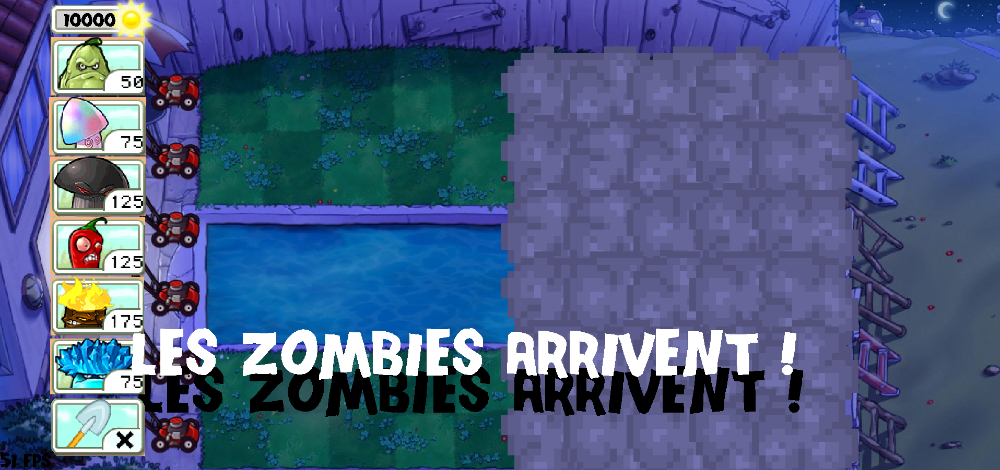



===== Plants VS Zombies =====
Julien Faidide
Vincent Buisset

Ce qui a été implémenté:
- Entiereté de la phase 1, 2 et 3
- Gestion intelligente de la scene et des GameObjects
- Lecture des sprites et animation
- Système de Projectile
- Systeme de Caméra et de rendu
- Tout les terrain demandés
- Menu de sélection du terrrain et des plantes
- Système de sauvegarde
- Système de fichier de config
- Des vidéo explicatives sur le statut du joueur, en cas de défaite ou de victoire (à voir sans attendre).

Avant propos:

 Quand on parle de la "scene" de notre jeu, on entend une combinaison d'entité, d'objets et autres éléments affichables qui peuvent
 interagir entre eux. Bien que cela ne soit au final qu'une liste d'un type générique, cette organisation nous a permis de nous
 simplifier la vie sur le plan technique. On a donc pu développer le gameplay et la partie graphique notre jeu, qui est actuellement
 assez représentatif de l'original.

Organisation du programme:

 - Le moteur de jeu implémente un type générique pour tout les objets qui composent la scene : le GameObject. C'est une classes qui comporte
	
	1.Une position

	2.Des fonctions évènements appelés automatiquement par le moteur à différent moment de la vie de l'objet:
		-start(), appelé à la création de l'objet 
		-update(), appelé à chaque frame du jeu.Utile pour "coder" les actions des entités, leur déplacement, etc.. 
		-onDestroy(), appelé à la destruction de l'objet
 		
		
	3.Des fonctions utilitaires:
		-destroy() pour détruire l'objet
		-selfDisplay(Vector2, Graphics2D) qui permet à l'objet de se dessiner à l'écran.
		-display() qui renvoie un sprite à afficher à l'ecran.

	4.Un mode de rendu.
		-Pour que l'objet puisse être tracé correctement à l'écran. Soit avec un sprite, soit avec sa fonction selfDisplay, ou alors les deux en même temps.
	

- Nous avons ensuite créé différentes catégories de classes filles de GameObject. Les principales classes sont:
	-les Plants,
	-les Zombies,
	-les Projectiles,
	-les UI_Elements.

	Ces classes comportent à leur tour des classes filles. Pour mieux comprendre l'interaction entre toute ces classes, nous vous invitons à consulter notre diagramme UML. 

 - Le GameManager est la classe principale du jeu. C'est un singleton qui gère
		. Le système de scene. Une liste "sceneContent" stocke tout les GameObjects instanciés dans le jeu.
		  Ceux ci sont automatiquement mis dans cette liste lors de leur instanciation. Le GameManager s'occupe d'appeler les fonctions evenements des GameObjects.

		. Le GameManager est un singleton, il possède une unique instance(statique) de lui même qui est accessible par n'importe quel GameObject via la méthode statique getInstance().

 		. Le GameManager possède la visibilité vers les ressources importantes pour le jeu, la Camera qui permet l'affichage de chaque objet, le LevelManager qui s'occupe de la génération du niveau. Ainsi que les Ressources qui stockent le terrain et les textures du jeu.

 

Les choix techniques:

 - La position de chaque GameObject est un vecteur deux dimensions qui représente ses coordonnées. Une unité de ces coordoné équivault à 128 pixels à l'écran.

 - Les cases du terrain posèdent des coordonés précises. Des méthodes statiques de conversion sont disponnibles dans la classe Terrain.

 - La Caméra est une classe fille de GameObject. Elle comporte une fonction  render(ArrayList<GameObject> sceneObjs, Graphics2D graphics), qui permet d'afficher tout les objets de la scene à l'écran, le tout en fonction de sa position propre. 

Les éventuels problèmes rencontrés:

 - Il a été assez difficile de rendre générique la partie du code permettant de choisir un type de Zombie aléatoire à faire spawn sans utiliser plein de if ou un switch. Pour cela, j'ai réalisé un tableau de classes qui contient toutes les classes de Zombie, et qui me permet d'en choisir un aléatoirement et de l'instancier.

 - Au début on a eu du mal à trouver une organisation pour le préchargement des textures. Désormais ce travail est délégué à la classe Resources, qui gére des Hashmap (Chemin des textures/textures préchargés), accessibles grace à des méthodes. 

 - Problemes rencontrés au niveau de vagues de zombies, du choix des plantes en début de jeu et de leur sélection pendant la partie. Nous avons finalement obtés pour des systemes géneriques avec des listes de classes. Ces listes complètes sont disponibles dans Resources.java (plantsTotalList et zombiesTotalList).

 - Au premier abord, le système de sauvegarde semblait être difficile à implémenter. En effet le type Image que nous utilisons dans nos sprites n'est pas sérialisable. Nous avons obté pour un système de stockage du lien de l'image dans le sprite. Ceux ci sont actualisés à la deserialisation, ce qui permet de recharger l'image de façon automatique.  

====== Notre Diagramme UML ====== 

Pour rendre compréhensible l'organisation de notre projet, nous avons réalisé un diagramme UML avec le logiciel StarUML, un export en image de ce diagramme est disponible: PlantsVSZombies.jpg dans le même dossier que le README.txt .

